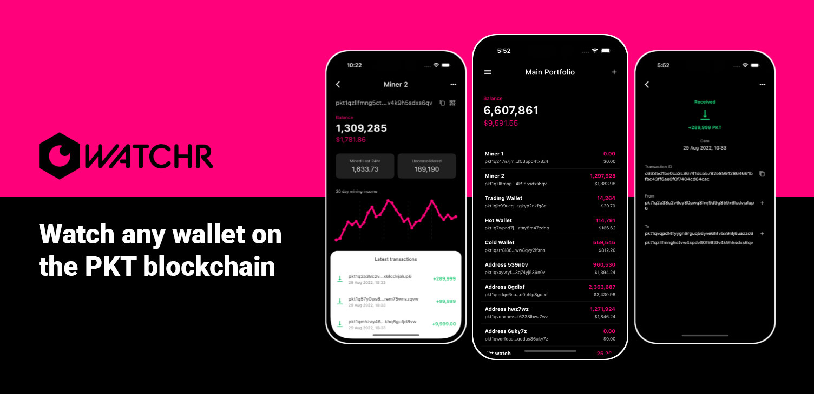

# Watchr

    

Watchr is a crypto tracker app specifically for the PKT Cash blockchain. Track balance, mining income and transactions for any wallet address.

## About

The application is built with [Flutter](https://flutter.dev/), an open source framework by Google for building natively compiled, multi-platform applications from a single codebase.

The app includes layouts optimised for both phone and tablet on iOS, iPadOS and Android.

Watchr is available for free on your favourite app store:

App Store 👉 [Download](https://apps.apple.com/app/watchr-by-pkt-watch/id6448482867)   
Google Play 👉 [Download](https://play.google.com/store/apps/details?id=watch.pkt.walletwatcher.wallet_watcher_cloud)
